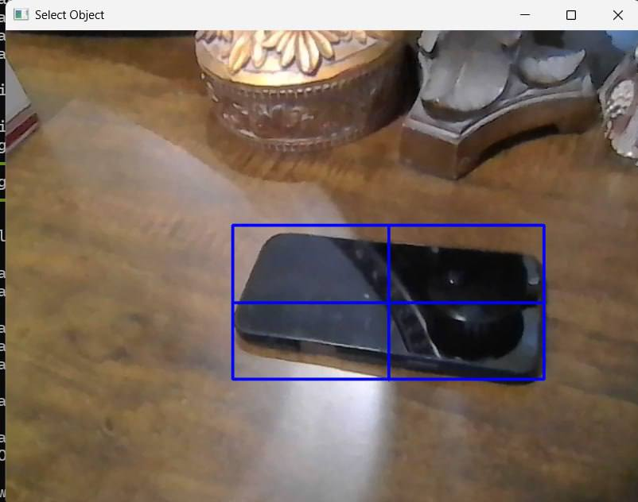
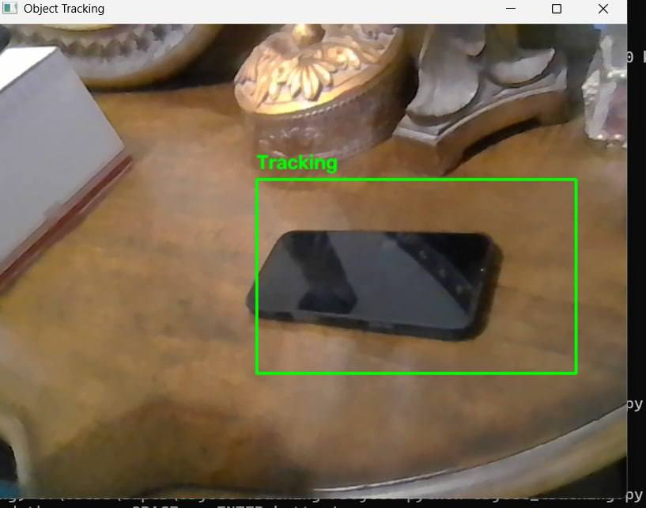
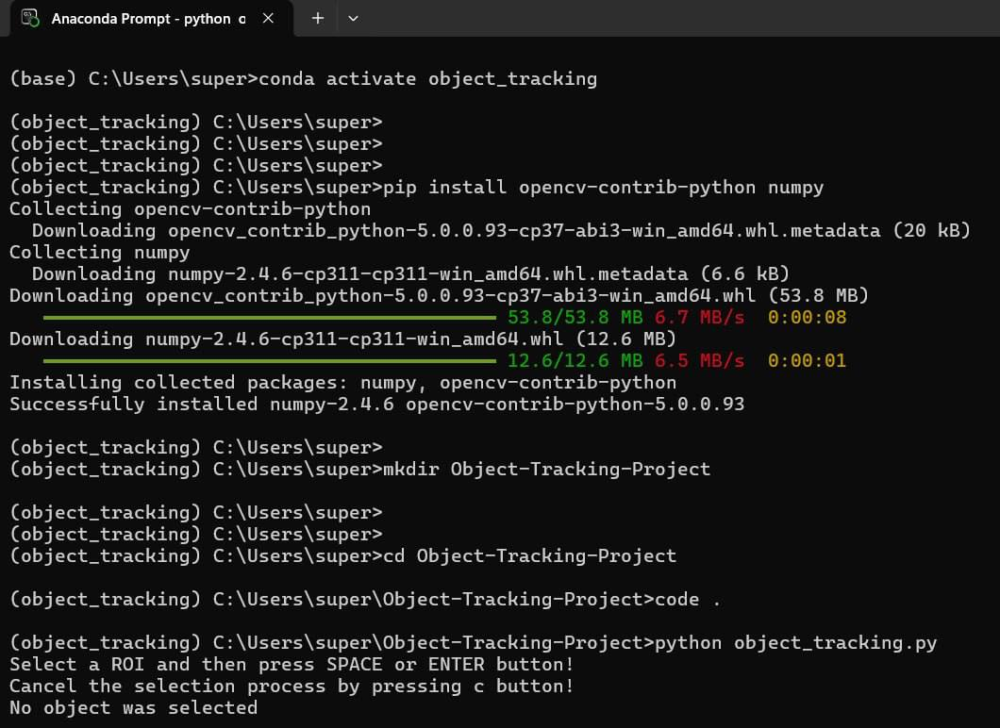
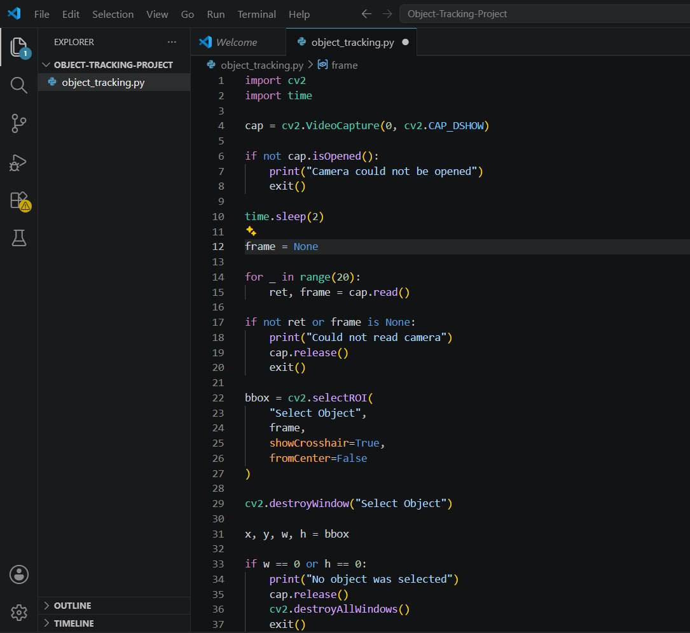

# Object Tracking using OpenCV

A simple Object Tracking project built with Python and OpenCV.

## Overview

This project demonstrates real-time object tracking using a webcam. The user selects an object from the first camera frame, and the tracker follows the selected object while it moves.

## Features

- Real-time object tracking
- Webcam support
- Manual object selection (ROI)
- OpenCV CSRT Tracker
- Simple and easy to use

## Requirements

- Python 3.x
- OpenCV
- NumPy

Install the required libraries:
pip install opencv-contrib-python numpy

## How to Run

Run the project using:
python object_tracking.py

### Steps

1. The webcam opens.
2. Select the object using the mouse.
3. Press SPACE or ENTER.
4. The tracker starts following the selected object.
5. Press Q to exit.

## Project Structure
Object-Tracking-OpenCV/
│── object_tracking.py
│── README.md
└── screenshots/
    │── photo1.jpg
    │── photo2.jpg
    │── photo3.jpg
    └── photo4.jpg

## Technologies Used

- Python
- OpenCV
- NumPy

## Screenshots

### Object Selection

### Object Tracking

### Terminal Output

### Source Code

### The Code 
import cv2
import time

cap = cv2.VideoCapture(0, cv2.CAP_DSHOW)

if not cap.isOpened():
    print("Camera could not be opened")
    exit()

time.sleep(2)

frame = None

for _ in range(20):
    ret, frame = cap.read()

if not ret or frame is None:
    print("Could not read camera")
    cap.release()
    exit()

bbox = cv2.selectROI(
    "Select Object",
    frame,
    showCrosshair=True,
    fromCenter=False
)

cv2.destroyWindow("Select Object")

x, y, w, h = bbox

if w == 0 or h == 0:
    print("No object was selected")
    cap.release()
    cv2.destroyAllWindows()
    exit()

tracker = cv2.TrackerCSRT_create()
tracker.init(frame, bbox)

while True:
    ret, frame = cap.read()

    if not ret:
        break

    success, bbox = tracker.update(frame)

    if success:
        x, y, w, h = [int(value) for value in bbox]

        cv2.rectangle(
            frame,
            (x, y),
            (x + w, y + h),
            (0, 255, 0),
            2
        )

        cv2.putText(
            frame,
            "Tracking",
            (x, y - 10),
            cv2.FONT_HERSHEY_SIMPLEX,
            0.7,
            (0, 255, 0),
            2
        )
    else:
        cv2.putText(
            frame,
            "Object Lost",
            (20, 40),
            cv2.FONT_HERSHEY_SIMPLEX,
            1,
            (0, 0, 255),
            2
        )

    cv2.imshow("Object Tracking", frame)

    if cv2.waitKey(1) & 0xFF == ord("q"):
        break

cap.release()
cv2.destroyAllWindows()

## Author
Turki Alkhelaiwi
Summer Training Project 2026
